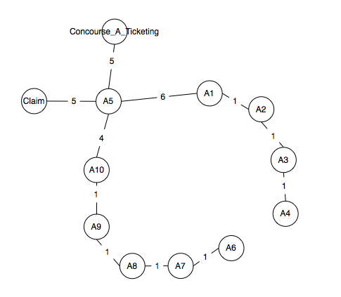

#Airport Baggage

* [Quick-Start](#Quick-Start)
* [Description](#Description)
* [Design](#Design)
* [Notes](#Notes)

-----------------

##Quick-Start

This project uses Junit for testing, and Gradle for building and running the tests. Running the test or the 
application is simple using gradle. (Note: this should work fine on Windows, though I don't have a Windows machine 
to test on. Instructions here are for Mac and Linux).

__Running Build__

    ./gradlew build

__Running Tests__

    ./gradlew test

__Running Application Main__

    ./gradlew run

__Running Build, Tests, and Application Main__

    ./gradlew

__Build a jar and run from the jar__

    ./gradlew jar
    cd build/libs
    java -jar ./airport-baggage-1.0.jar <your input file>

##Description

The goal of the project was to design an application that would find the "optimal" path through a bi-directed 
weighted graph. This was a simple exercise with a few key areas of focus; pathfinding algorithms and TDD (test 
driven development).

The first target was to first find and implement the algorithm necessary to find the optimal path. The overall 
idea of the algorithm component was to find the shortest time path from one node (terminal in this case), to 
another node. To be clear, my assumption here was that optimal referred to the time it took for a bag to 
travel between nodes and not the least amount of nodes travelled. 

The second focus was to perform the implementation with TDD, or at least some of the basics of TDD. I made an 
honest attempt to build much of the testing components just before the actual implementation. Since I've never 
used this professionally, there were some slips as I began to get more comfortable with it. I created unit 
tests for much of the codebase. I'm not entirely sure whether dummy beans are supposed to have unit tests, so 
I didn't fully test every getter and setter. I'm not really convinced that would be necessary. I did have 
simple tests for things like `equals` or `toString` as those would be more involved in a more advanced 
implementation (though in this case, the overrides were just simple string tests).

##Design

The simple nature of the project only lead to two main components, Lexical Parser and Routing Engine. The package 
structure mostly reflects this split, though there is a domain package that contains the basic data beans. 
Because of this, it isn't quite package-by-feature, mainly because of the small number of features.

__Parsing__

The input data is given as three distinct sections. First is the _Conveyor System_ that describes the graph of 
linked terminal nodes, and the time distance between them. A sample input is given as the following:

    # Section: Conveyor System
    Concourse_A_Ticketing A5 5
    A5 BaggageClaim 5
    A5 A10 4
    A5 A1 6
    A1 A2 1
    A2 A3 1
    A3 A4 1
    A10 A9 1
    A9 A8 1
    A8 A7 1
    A7 A6 1

The second section of data describes the _Departures_ section. 

    # Section: Departures
    UA10 A1 MIA 08:00
    UA11 A1 LAX 09:00
    UA12 A1 JFK 09:45
    UA13 A2 JFK 08:30
    UA14 A2 JFK 09:45
    UA15 A2 JFK 10:00
    UA16 A3 JFK 09:00
    UA17 A4 MHT 09:15
    UA18 A5 LAX 10:15

The third section of data describes the _Bag_ section. 

    # Section: Bags
    0001 Concourse_A_Ticketing UA12
    0002 A5 UA17
    0003 A2 UA10
    0004 A8 UA18
    0005 A7 ARRIVAL

The `RoutingInput` handles the work of opening the IO (using `Reader`, `InputStream`, or `String` filename), and 
iterates over the lines of the input delegating the actual paring of the line to a `RowParsingDelegate`. Each section 
type has an extension delegate that knows how to parse that section row type. Here, the original design had 
`SectionParser`s for each `SectionType` that wrapped the row parsing for a given input. This turned out to not work 
well in integration, so the `MultiSectionParser` was created so multiple sections could be parsed at the same time for 
a given input. This kept from having to create `Reader`s for every section type. This code should be factored out, but 
I'll leave it on another branch as a postmortem on what _not_ to do.

__Routing__

The basic graph to search had a data description of "&lt;Node 1&gt; &lt;Node 2&gt; &lt;travel_time&gt;" given in the 
first section of the data description. Using the sample input data given above, we can visualize the data as a set 
of connected nodes.

The chosen algorithm for finding the shortest path of this graph was Dijkstra's algorithm. For the implementation 
details, I consulted an old algorithms book I had, "Computer Algorithms: Introduction to Design and Analysis 3rd 
Ed." (2000) by Baase and Van Gelder, and the [Wikepedia](http://en.wikipedia.org/wiki/Dijkstra's_algorithm) page 
for the algorithm.

The algorithm was implemented using the strategy pattern so that the actual searching implementation could be easily 
replaced for other algorithms for other circumstances. The context for the strategy is the the `SearchablePath`, which 
itself is a decorator for `WeightedGraph`s. `WeightedGraph` is just a `Graph` implementation with the addition of 
`WeightedEdges`. Decorators were used on the search components mainly because those properties just didn't seem to 
belong to each of those types. For instance, a `Node` shouldn't necessarily know about a _previous_ `Node`. That 
really only makes sense while you're performing operations like searching.

The `RoutingEngine` is an aggregate that wraps the other components into an easy-to-use Facade. The `BagRouter` is 
a `main` class that just runs the engine for a sample input. Something like this wouldn't be run with a `main`, but 
it's there for the sake of running the application in lieu of running the tests.

##Notes

As a foray into TDD, this turned out to be pretty interesting for me. I've not worked professionally with TDD, 
so I wasn't sure about the hype. Since this was an introduction-level attempt, I'm not entirely sure I did everything
by-the-book in terms of TDD. I did actually find it to be quite useful in identifying mistakes and typos without 
having to have an entire working project, and just running final integration tests as I have typically done. It 
also gave me confidence in previously written classes as I began to integrate the major components. I did find it 
somewhat difficult to separate the pure unit testing from integration testing at times, but I think it will get 
easier with a little more practice. Overall, I think it was an eye opener for me into how I can start using 
this day-to-day.
